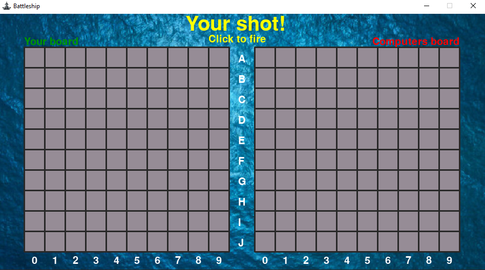
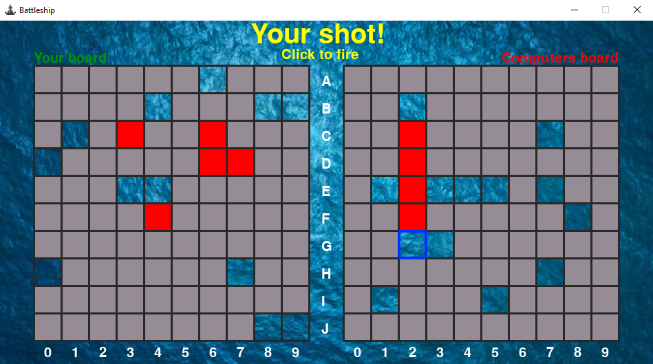
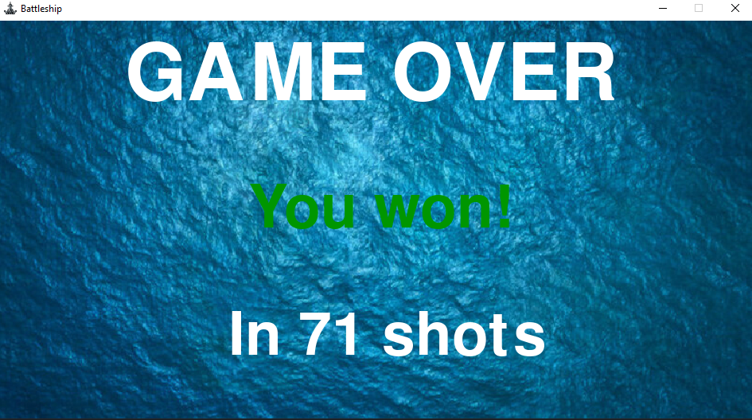

# Battleship

## About
> I made this game for a few hours a day for a week or so, it is my first project in pygame.

## Tutorial
**Place your ships**
> 

**Computer places it's ships**
> 

**Fire at the computers grid**
> 

**See who won and in how many shots**
> 

## Issues & Suggestions
> Submit an [issue](https://github.com/LucasJWilliams/Battleship/issues) if you find any problems or have any ideas.
